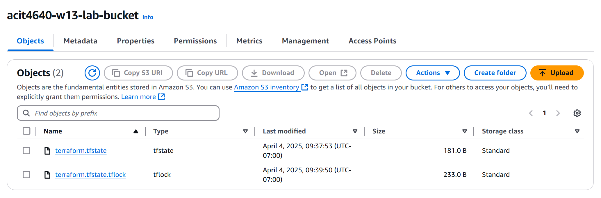
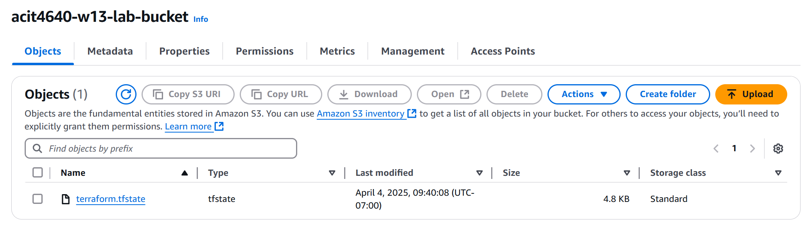

# 4640-w13-lab-start-w25

### team
- Nai Yen Lin
- Yang Jung

### Q1. When is the state file created?
The Terraform state file is created right after you run the "terraform apply" command, assuming the remote backend is correctly configured and the infrastructure is successfully deployed.

### Q2. When is the lock file present?
The lock file is created temporarily during any Terraform operation such as "terraform plan" or "terraform apply". It exists only while Terraform is actively working to prevent conflicting operations.

### Q3. Is the lock file always in the bucket after it is created?
No. The lock file is not permanent. It is automatically deleted once the Terraform operation finishes successfully. It only exists while Terraform is performing an action.
